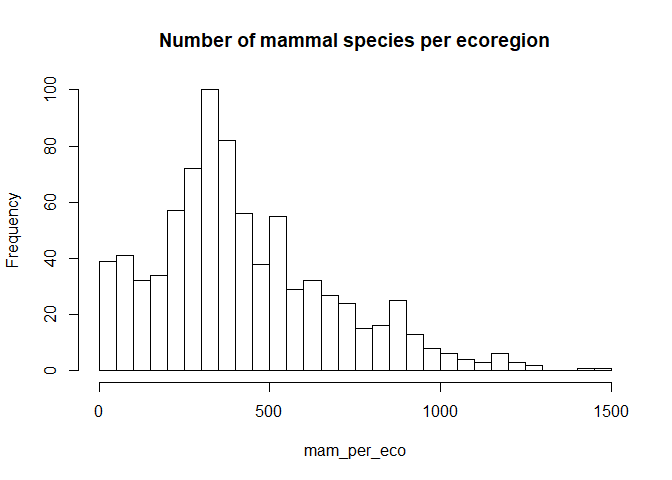

# Introduction

Dans cet exercice nous allons utiliser le package `dplyr` pour nous instruire sur la biogéographie des ours.

# Données

On utilise la base [**WWF Wildfinder**](https://www.worldwildlife.org/pages/wildfinder-database)

La base de données WildFinder du WWF contient des données de présence/absence pour les amphibiens, reptiles, oiseaux et mammifères terrestres du monde entier au niveau des écorégions terrestres. Seul le sous-ensemble des mammifères est disponible dans ce dépôt avec 4936 espèces. Les données, préalablement nettoyées, sont structurées de la manière suivante dans le dossier `data/wwf-wildfinder/` :

  - `wildfinder-mammals_list.csv` : liste taxonomique des 4936 espèces de mammifères du monde entier
  - `wildfinder-ecoregions_list.csv` : liste des 798 écorégions terrestres définies par le WWF
  - `wildfinder-ecoregions_species.csv` : correspondances entre les espèces et les écorégions

# Analyses

## Loading data


```r
# read ecoregion data
ecoreg <- datatoolboxexos::data_ecoregion()

# read mammals data
sp <- datatoolboxexos::data_mammals()

# read ecoregions-species data
ecoreg_sp <- datatoolboxexos::data_mammals_ecoregion()
```

## Instruction (2)

Dans combien de royaumes, biomes et écorégions différents retrouve-t-on chacune des 7 espèces d'Ursidés ?


```r
library(tidyverse)

Ursidae <- sp %>%
  dplyr::filter(family == "Ursidae", sci_name != "Ursus malayanus") %>%
  dplyr::select(species_id, sci_name, common) %>%
  dplyr::left_join(., ecoreg_sp, by = "species_id") %>% # first join with ecoreg_sp data
  dplyr::left_join(., ecoreg, by = "ecoregion_id")  # second join with ecoreg data

# for realms  
realm_ursidae <- Ursidae %>%
  dplyr::group_by(sci_name) %>%
  dplyr::summarise(n_realm = n_distinct(realm)) # n_distinct same as length(unique(...))

# for biomes
biome_ursidae <- Ursidae %>%
  dplyr::group_by(sci_name) %>%
  dplyr::summarise(n_biomes = n_distinct(biome))

# for ecoregions
ecoreg_ursidae <- Ursidae %>%
  dplyr::group_by(sci_name) %>%
  dplyr::summarise(n_ecoreg= n_distinct(ecoregion))

# bind all data
info_ursidae <- realm_ursidae %>%
  left_join(biome_ursidae, by = "sci_name") %>%
  left_join(ecoreg_ursidae, by = "sci_name") %>%
  arrange(desc(n_ecoreg))

info_ursidae
```

```
## # A tibble: 7 x 4
##   sci_name               n_realm n_biomes n_ecoreg
##   <chr>                    <int>    <int>    <int>
## 1 Ursus arctos                 3       11      139
## 2 Ursus americanus             3       10       82
## 3 Ursus thibetanus             3       11       78
## 4 Helarctos malayanus          2        5       37
## 5 Tremarctos ornatus           1        3       23
## 6 Melursus ursinus             1        6       21
## 7 Ailuropoda melanoleuca       1        4        6
```

## Exploration des données

- Histogramme de la distribution du nombre d'espèces de mammifères par écorégion.


```r
#read wildfinder-ecoregions_species.csv
sp_eco <- datatoolboxexos::data_mammals_ecoregion()
```

```
## Parsed with column specification:
## cols(
##   ecoregion_id = col_character(),
##   species_id = col_double()
## )
```

```r
#tabulate the ecoregions
mam_per_eco <- table(sp_eco$ecoregion_id)
#histogram
hist(mam_per_eco,
     main = "Number of mammal species per ecoregion",
     breaks = 50
)
```

<!-- -->
