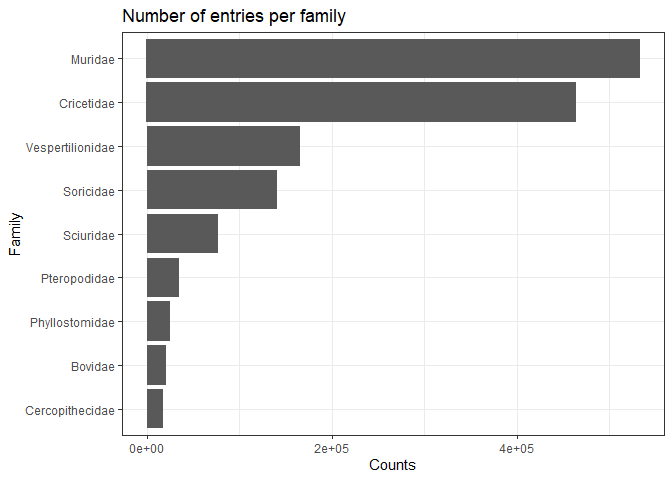
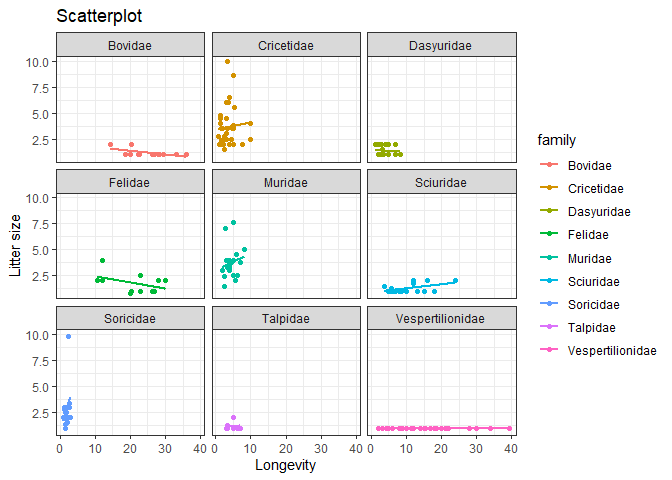

# Introduction 

blablabla

# Données

blablabla

# Analyses

## Loading data


```r
devtools::load_all()
pantheria <- datatoolboxexos::pantheria()
```

## Tidy the dataset


```r
library(tidyverse)
tidy_pantheria <- datatoolboxexos::tidy_pantheria(pantheria)

tidy_pantheria
```

```
## # A tibble: 5,416 x 8
##    order        family      adult_bodymass dispersal_age gestation homerange litter_size longevity
##    <fct>        <fct>                <dbl>         <dbl>     <dbl>     <dbl>       <dbl>     <dbl>
##  1 Artiodactyla Camelidae          492714.           NA      387.      NA              1      480 
##  2 Carnivora    Canidae             10392.          330.      65        1.01          NA      137 
##  3 Carnivora    Canidae              9659.           NA       61.2      3.13          NA      192 
##  4 Carnivora    Canidae             11989.          255       61.7     19.9           NA      262 
##  5 Carnivora    Canidae             31757.          180       63.5     43.1            2      354 
##  6 Artiodactyla Bovidae            800143.           NA      274.      NA              1      314.
##  7 Artiodactyla Bovidae            500000            NA      274.      NA              1      267 
##  8 Artiodactyla Bovidae            635974.           NA      297.      NA              1      319.
##  9 Primates     Pitheciidae          1117.           NA      129.      NA             NA       NA 
## 10 Primates     Pitheciidae            NA            NA       NA       NA             NA       NA 
## # ... with 5,406 more rows
```

## Data exploration 

What is the mean home range by family? Standard deviation? The sample size?


```r
explo_pantheria <- datatoolboxexos::explo_data(tidy_pantheria)
```

## Data visualisation

Bar chart of the number of entries per family


```r
datatoolboxexos::Graph1(tidy_pantheria)
```

<!-- -->

Scatter plot of litter size as a function of longevity


```r
datatoolboxexos::Graph2(tidy_pantheria)
```

<!-- -->

